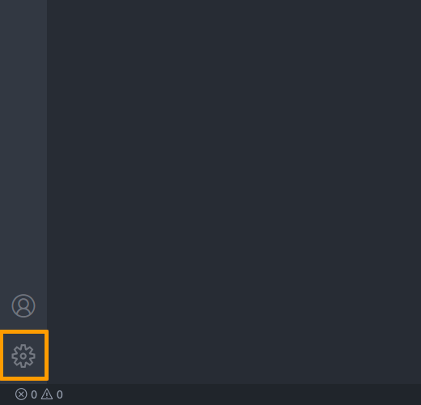

+++
title = "TeX Setup"
+++

How to get TeX up and running with UTF-8 on various systems, using XeLateX and VSCode.

<center>


</center>

## What is this ?

This is a tutorial to get a TeX distribution running on Linux/Windows, with UTF-8 support, using the Visual Studio Code editor.

(This is also a personal reminder in case I need to do it all again 🙂)

### Why UTF-8 ?

I find it way easier to write/read TeX documents this way: for me,

```tex
Hellö W⊕rld
$$ f: Xₙ → ℒ ∪ ℂ ∪ ∅ $$
```

Is way more readable than:

```tex
Hell\"{o} W$\oplus$rld
$$ f: X_n \to \mathcal{L} \cup \mathbb{C} \cup \emptyset $$
```

Also don't worry too much about portability: this setup works on Windows, Linux, and even ([imperfectly](#drawbacks)) Overleaf (with the compiler set to `XeLateX`).

### Why VSCode ?

- It has decent latex support: autocompletion, syntax highlighting, view PDF...
- This is a _modern_ editor: this means it looks pretty good, has a lot of configuration options, is extensible...
- It can also be used to code in various programming languages if you need to (in fact, this is its main purpose)
- You can use extensions to easily insert UTF-8 characters.

### Drawbacks

- This was not tested on Mac, or linux/BDS distributions other than Debian.
- VSCode is open source, but it _is_ being developped by Microsoft: you may have an issue with that.
- It consumes a slightly high amount of memory
- Overleaf does _not_ support every UTF-8 character, only those in the [basic multilingual plane](<https://en.wikipedia.org/wiki/Plane_(Unicode)#Basic_Multilingual_Plane>). This is usually fine, but some characters like `𝒢` fall outside of this range.

## Dependencies

**Be sure to install the dependencies for your system before continuing !**

- [Windows](dependencies-windows "Windows dependencies")
- [Linux](dependencies-linux "Linux dependencies")

## Visual Studio Code setup

Now that we have all we need, launch VSCode.

We will need a few things to get the TeX support we want:

### Extensions

VSCode can be extended with third-party addons called extensions.

To install extensions, go to the extensions panel:


There, you can search and install extensions. Install the following extensions:

- LaTeX Workshop
- latex-input
- Unicode Latex

### Settings

Now since we use `xelatex` instead of the more classic `latex`, we need to change some settings. Open the settings on the bottom-left:




You can modify the settings from here, but it will be easier to change the settings file directly. Click on the "Open Settings (JSON)" button on the top-right:


And replace the content of the file with

```json
{
  // Use XeLateX instead of LateX
  "latex-workshop.latex.tools": [
    {
      "name": "latexmk",
      "command": "latexmk",
      "args": [
        "-xelatex",
        "-output-directory=build",
        "-synctex=1",
        "-interaction=nonstopmode",
        "-file-line-error",
        "%DOC%"
      ]
    }
  ],
  // Put the build artifacts in a 'build' directory next to the '.tex' file
  "latex-workshop.latex.outDir": "%DIR%/build",
  // View the resulting PDF in dark mode.
  "latex-workshop.view.pdf.invertMode.enabled": "always",
  "latex-workshop.view.pdf.invert": 0.9,
  // View the PDF directly in VSCode
  "latex-workshop.view.pdf.viewer": "tab"
}
```

(Remove the lines you don't want)

The LateX Workshop extension has various interesting settings, don't hesitate to play with these

## Write some TeX !

Now we can start writing TeX !

Open a new directory in VSCode, and create a new `main.tex` file in it. Fill it with

```tex
\documentclass[a4paper]{article}

\usepackage{fontspec}
\usepackage{unicode-math}
\setmainfont[Ligatures=TeX]{FreeSerif}

\begin{document}

Hellö W⊕rld
$$ f: Xₙ → ℒ ∪ ℂ ∪ ∅ $$

\end{document}
```

You can then:

- Build the document:

  

- View the resulting PDF:

  

The resulting PDF (and intermediary files) can be found in the `build` directory next to `main.tex`.

### Easily write UTF-8

Note the 2 extensions we installed after Latex Workshop: **latex-input** and **Unicode Latex**. These will help us write any character we want:

- **Unicode Latex** allow you to insert almost any UTF-8 character you want. In VSCode, open the command prompt with `Ctrl+Shift+P`, and type `Unicode: Insert Math Symbol`. You then have access to the list of characters, with a search function based on the name of their TeX command.

  

- This is a bit annoying to use though: and that is why we have **latex-input** ! This allow us to gain autocompletion for various UTF-8 characters: just type `\` and the name of the command you want:

  

  latex-input is customizable via a json file (the version number may change):

  - `.vscode/extensions/yellpika.latex-input-1.0.0/default-mappings.json` on Linux.
  - `C:\Users\<USERNAME>\.vscode\extensions\yellpika.latex-input-1.0.0\default-mappings.json` on Windows.

  If you want, the [latex-input-mappings.json](./latex-input-mappings.json) file provides a reasonable extension to the default: just use its content to overwrite `default-mappings.json`.
